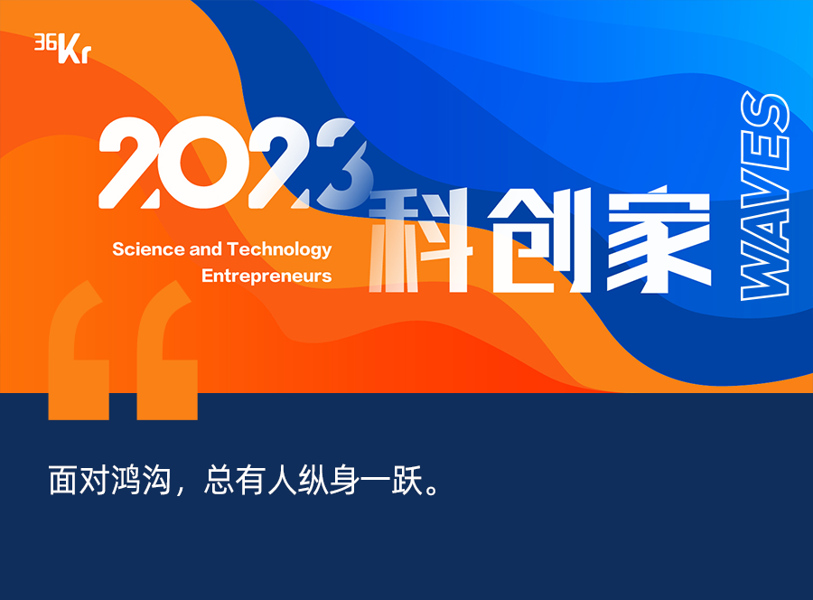
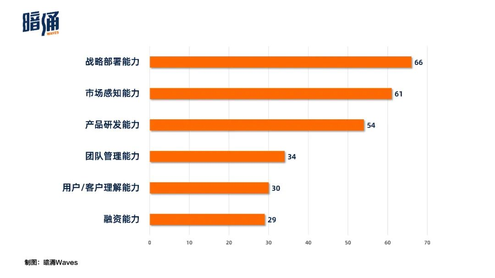
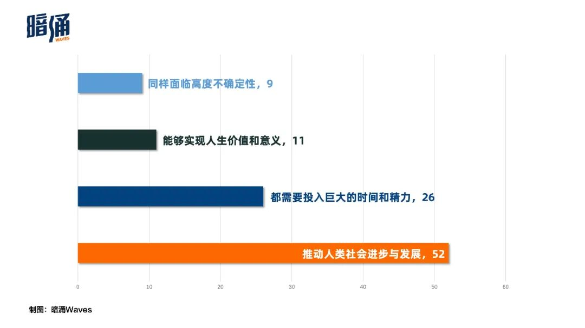
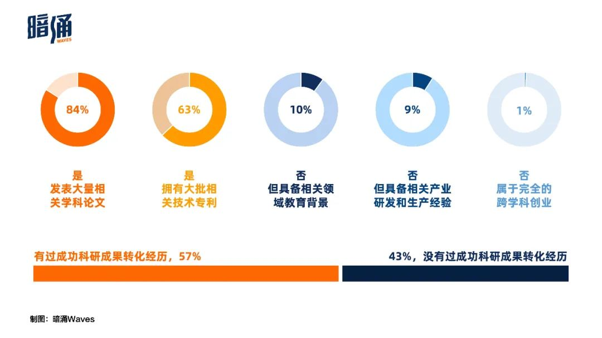
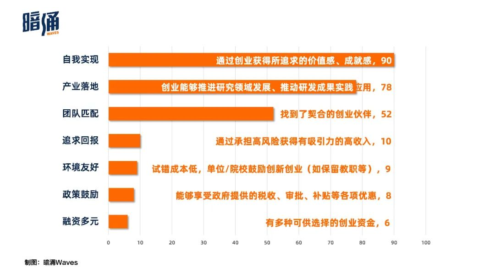
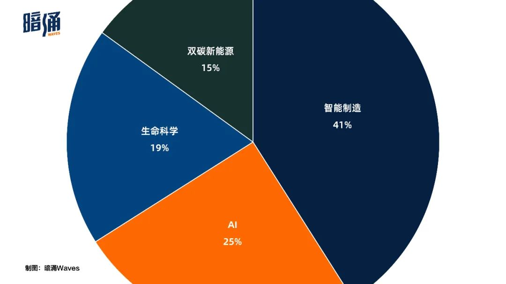
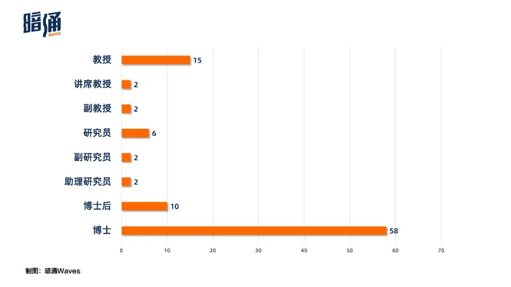

# 当一群教授走出象牙塔：富矿、鸿沟、名利场
源网页：https://mp.weixin.qq.com/s/yySqpvdNpYaLkEb2XCAhiw
摘抄自：@暗涌Waves

【导读饶】23/11/21 我关注合成生物学领域迄今已有5年，缘起本科时候的iGEM比赛，后来看到知乎上一群人进行炒作和梳理，他们的文章比综述要好看，看完让人热血澎湃，过了两年，确实有势头起来了，初创公司一抓一大把，尤其是2023年过年的时候，我一边和家人吃饭，一边看着深波公众号总结的一大把融资行为，我也自己梳理了合成生物学大旗下的赛道和玩家，也寻求与这些人的联系和连接。随着今年8月份，TR50的凯赛生物旗开得疲，这一阵热血和激烈的投资也肉眼可见的变凉。今天看见这篇文章以一个新的视角来阐释这些科研项目、商业项目以及初创公司之间的联系。

## 围猎教授
&emsp;&emsp;2022年9月，红杉中国在接触一家新能源创业公司一周后，迅速给出了TS。

&emsp;&emsp;这家公司是中国石油大学储能科学与工程系主任徐泉教授的第一家创业公司：中海储能。在储能技术这个新能源大规模应用上的关键环节，铁铬液流电池技术路线被认为是少有的满足商业化要求的解决方案，而中海储能恰是这种技术路线的代表性公司。

&emsp;&emsp;非但如此，中海储能还有一个大部分投资人心目中的完美创始班底：院士+CTO+CEO。以首席科学家身份参与中海储能运营的是院士徐春明，担任CTO的是院士门下储能领域负责人徐泉，担任CEO的则是有过不止一次成功创业经历的职业经理人王屾。这种配置意味着，资源、技术和商业化能力这三种创业要素的强强叠加。

&emsp;&emsp;继红杉中国后，不足3个月，源码资本、经纬创投、清流资本跟进数亿元人民币。

&emsp;&emsp;2022上半年，随着一级市场早期项目的与日递减，像徐泉这样的高校教授成为诸多投资人的重点围猎对象。一时间，不仅双碳新能源，包括生物医药、新一代信息技术、智能制造等技术密集领域，投资人去“各大高校找项目”蔚然成风。

&emsp;&emsp;投资人们每天的工作被“搞研究、查论文”这些案头工作填满，而看得懂论文、能跟教授探讨技术话题，也成为投资人的基础素养。他们地毯式搜罗技术领先的科研学者，制作各大高校的教授图谱，甚至把教授照片也贴上，以便更直观地感受这个群体。之后，一封封地给各位教授发邮件。

&emsp;&emsp;一位操作颇多并深谙其道的头部基金年轻投资人向我们强调，邮件中“一定提到要提及论文名并且高光标注”，“这样才能提高成功率”，所以一个标准的约访教授的邮件话术是：“*教授您好，看到您这篇论文，我学到了很多。希望跟您约个时间聊一下”。

&emsp;&emsp;他们背后的投资机构也开始内部换血，很多机构招人时，开始从纯商科背景向理工科综合背景迁移。

&emsp;&emsp;此时的高校中青年副教授们也行动起来，一些有产学研项目经验的老师们，甚至考虑全身投入创业。像开头提到的中国石油大学的徐泉，这位美国北德克萨斯大学博士毕业的36岁教授，除了完成学校教学科研任务，剩余精力全部倾注在中海储能。石油大学到十纪科技大厦间的两公里道路，成为徐泉最近一年往返最频繁的地方。而他背后的储能专业，因为在储能赛道的风口之上，一年间也增加了20个教育部储能急需人才博士培养名额。

&emsp;&emsp;教授产业影响力大、人脉网络覆盖强，如果院士带队，和产业方的合作也更顺畅。一时间，高校被视作优质创业公司诞生的富矿。

## 一道鸿沟
&emsp;&emsp;但不足半年，“去高校找创业者”的想法就开始降温。

&emsp;&emsp;投资人们意识到如此“挖宝”的ROI（投资回报率）极低：绝大多数mapping的教授，并不是“创业意向明确”的合适人选。

&emsp;&emsp;上述年轻投资人告诉「暗涌waves」：“有50%的教授收到邮件后是愿意交流的，但是最终创业的，极少数”。掣肘教授们的理由太多，其中不乏“有家要养、风险太大”等现实考量。一位投资人向「暗涌Waves」感叹：“科研人士对商业的不理解，令人震惊”。

&emsp;&emsp;而对很多科学家或教授来说，则完全混合着两种声音。一方面，是一种更大声量的认同，认为“实现国家创新驱动，科学家创业是必须”。但也有一些人很反感被打上“科学家创业”标签。一位支持学生孵化了很多创业公司的高校教授认为，所谓科研成果转化其实是一个一开始就脱离市场考虑的伪命题。而离开清华大学的教授施一公也曾在一次演讲中指出，科学家去创业是才能错配。

&emsp;&emsp;这中间当然是因为科研与商业的巨大鸿沟。而投资人寻找科学家创业的过程，也是不断遭遇问题的过程。
比如一些教授常常拿学术圈的排位，来联想公司的估值——“我的学生创立的公司做得风生水起，我怎么可能不行？”、“我师弟的公司估值那么高，我公司的估值为什么比他低？”

&emsp;&emsp;再比如，融资后只有技术人员到位，其他核心成员迟迟组不齐——“我只管提供技术，你们投资人来给我划战略、找人才”；好不容易融到B轮了，负责技术部分创始人因为学术太忙要中途缺位……

&emsp;&emsp;那么，对于教授和科学家来说，最关键的创业能力是什么？

&emsp;&emsp;为了解答这个疑问，「暗涌waves」向百余家公司发起了问卷调研。答案主要分布在战略部署、市场感知、产品研发、团队管理、用户理解、融资等六大方面。其中，战略部署、市场感知和产品研发能力得票最高。

&emsp;&emsp;关于科学家创业需要的关键能力

&emsp;&emsp;其中战略部署是一场残酷的淘汰赛。

&emsp;&emsp;民营火箭公司东方空间创始人姚颂与「暗涌Waves」谈到，这波技术创新浪潮之下，制造业公司普遍会经历层层关卡：“Demo研发是第一关，产品一致性是第二关。而后，从小规模量产到半自动流水线规模化量产，又涉及供应链整合能力和成本控制问题。”姚颂分析，制造业领域的公司，很多壁垒其实不在技术上。技术大致能拉开12个月的身位差；工程化、量产化可以拉开36-48个月的差距。最后能跑出来的，会胜在产线成熟度上。

&emsp;&emsp;而团队管理大概是其中最具戏剧性的一个维度。

&emsp;&emsp;类似中海储能那种“院士+CTO+CEO”三方配齐，并不代表着公司的顺畅运作。因为横亘在三者之间是一个巨大的拷问：究竟谁来拍板、谁做决策？在一家强技术主导的公司中，技术负责人的声量往往会不知不觉盖过名义上的“商业一号位”，在公司发展上出现“外行”指挥“内行”情形，而其中的症结大概在于技术带头人/合伙人与商业一号位之间的信任关系——彼此应是平等伙伴，而非上下属。

&emsp;&emsp;不过经过调研发现，真正配齐上述“院士+CTO+CEO”组合的极少。一个更严重的情形是，很多科创公司并没有意识到设定商业一号位的重要性，这也是影响很多A轮阶段创业公司后续成长的缘由。

&emsp;&emsp;学校与公司也是一种巨大转换。“搞科研时，导师做很多科研选题，硕士和博士只要听从就可以了，但公司决策要求完全的市场化运作”，柏垠生物创始人兼首席科学家钟超教授对「暗涌Waves」如此表示。

&emsp;&emsp;市场感知和用户理解也是寻常被拿来诟病。科研与商业恰似跷跷板的两头：一边的终极目的是结论与成果，而另一边要的是尽可能满足客户与市场。能够同时理解两套思维体系，拥有平衡两者能力的人凤毛麟角。

&emsp;&emsp;时间与精力的有限又始终无法让跷跷板完全平衡。同时担任微构工厂创始人兼科学顾问的清华大学生命科学学院教授陈国强告诉「暗涌Waves」：“公司遇到小问题都自己解决，难攻克的才反馈到我这边，这可能成为一个基础科学问题。平时我主要还是在学院组织实验室开展基础研究。”

&emsp;&emsp;在我们发放的调研问卷里，设置问题“您认为科研与创业最大共同点”也同样提及了时间与精力的投入的问题——科研与创业，都并非一日之功。而科研人士投身创业，无疑是进入了一个耗时耗力的全新领域。

&emsp;&emsp;而颇为有趣的是，位居第一的是一个宏大答案：“推动人类社会进步与发展”。也或许，正是这种层面的统一，让很多人面对鸿沟还是会纵身一跃。

&emsp;&emsp;关于科研与创业的最大共同点
## N种尝试

&emsp;&emsp;即便面对巨大鸿沟，我们通过2个月的征集，还是找到了一群愿意留在竞技场，试图消弭鸿沟的科创者。作为从中国土壤中长出的科技创新代表，他们的存在，仍然提示着科研通往商业的种种可能。

&emsp;&emsp;科学家创业最佳位置的寻找过程，其实也是一个自我认知和自我突破的过程。

&emsp;&emsp;在中科创星创始人米磊看来，科技成果转化并非单纯鼓励科学家直接创业，很多科学家更适合做首席科学家或CTO，成果转化部分由CEO或专业的技术转移部门来负责。我们的调研结果也显示，尽管有84%的科创人员，在创业前就拥有学科论文成果，63%有过相关技术专利。但实际拥有成功科研成果转化经历的，不到六成。

&emsp;&emsp;关于在创业前是否已经持有相关领域高水平科技成果

&emsp;&emsp;值得一提的是，很多公司在创业开启第一步时，可能会遭遇知识产权转换难题。一些科创公司告诉我们：“院校及其下属基金会通过知识产权在公司持股，持股比例通常约在5%-30%区间。”但当公司发展到B轮、C轮时，出于各种原因，持股的院所可能中途突然提出退出要求，这一定程度上会给本就在初期经营阶段的公司带来精力消耗。“最理想的合作方式是院所在初期就直接把知识产权打包，做价转让给商业公司。”

&emsp;&emsp;调研中，东方空间创始人姚颂也向我们讲述了他所完成的自我突破。比如在团队管理上，针对现在公司中，分别来自体制内不同科研院所和市场化科技公司同事间的思维差异，每次决策，他都需要和各部门高管做好预沟通，去推动大家往一个共同方向去走。

&emsp;&emsp;而对投资人来说，同样在完成跨越。

&emsp;&emsp;在一位科技公司创始人看来，科学家创业潮的降温，其实源自很多科研还在科学论证阶段。这个阶段项目，如果用市场化方式去融资，加上国内资本市场周期比国外短，大家对公司的商业化预期就会过高。后面没有实现预期，整个市场信心就会迅速下滑。

&emsp;&emsp;而另一种现实是，科技投资在中国还处在发展早期。在上述创始人看来，中国投资机构大部分还是从互联网转型过来的，不是产业出身，这意味着很多投资逻辑，都需要一个适应过程。在姚颂看来，做过产业和没做过产业的人，认知鸿沟非常大。比如激光雷达领域，做一个Demo和模型非常容易，但做到几百个产品有可靠性、稳定性和一致性就非常困难。

&emsp;&emsp;投资技术公司和投资互联网不一样甚至还包括：投资技术公司的成功率平均只有5%，一旦技术路径走错，回报可能归零，而互联网公司无论做得大小都可能有回报。

&emsp;&emsp;除此外，鸿沟的消弭还需要一个更宏大的体系。在科学研究、产品落地到商业变现之间，近期有一个成功的路径转换例子：Open AI。

&emsp;&emsp;2015年，由Elon Musk和Sam Altman捐赠10亿美元启动Open AI——起初仅仅是一家AI研究实验室性质的非营利组织，拥有60余名顶尖工程师（engineer）和研究人员（scientist）。在AI科研领域贡献连连的同时，他们选择毫无保留的对外公布专利和研究成果，与其他组织和研究人员“自由互动”。

&emsp;&emsp;而后在2019年，为了聚集更大体量的资金和资源、激励研究人员。Open AI将其状态从「非营利」调整为「有上限的营利」，所有投资的利润上限为100倍，一旦它向投资者和员工完成义务，最终又会再次成为一家非营利组织。

&emsp;&emsp;这个独特而创新性的组织结构，获得了微软10亿美元的支持，并且与其旗下Azure云端平台建立了深度合作。而Open AI最终也因推出GPT-3.5、GPT-4、以及应用层的ChatGPT而大放异彩。

&emsp;&emsp;这的确是一个过于极致的例子，但它或许可以给中国的创业公司提供科研通往商业的诸多启发。

&emsp;&emsp;从组织内部讲，它提示了一个创新型组织的重要构成要素。除那些疯狂的理想愿景以外，「顶级人才的共同协作」和「灵活创新的组织架构」是成功的重要基础和催化剂。

&emsp;&emsp;而从外部讲，Open AI也提示了创新对长期的钱、有耐心的钱的渴望。事实上，这也是当下很多前沿科创公司的重要困境。随着中国一级市场风险偏好收缩、市场预期降低，地方政府和产业资本在投资创业公司又各有诉求，能够进入前沿科技领域的钱少之又少。

&emsp;&emsp;一位科技创始人告诉我们：“在美国产业投资兴起后的30年，部分富有家庭和个人投资者开始为技术创业公司提供资金。而在中国，因为老一代企业家自身安全感就不够丰沛，加上他们自身对于科技无感，所以把钱拿来惠及科技发展的观念并不普及。”

&emsp;&emsp;在我们调研的百余家科创公司中，不乏创始团队在公司发展早期自掏腰包的情景。比如，有工业SaaS公司在发展早期，创始团队卖了几套房来支持研发；也有合成生物公司，在去年市场低迷时，核心团队自己垫资数百万。
## 一些发现

&emsp;&emsp;在这次关于科学家创业的观察中，我们采用了基础信息收集、问卷调研以及实地采访三种方式结合。关于这些科创家，我们有很多有意思的发现。

&emsp;&emsp;比如在问卷调研中，我们发现：在事情之初，绝大部分科学家产生创业意愿的原因是：“自我实现”、“产业落地”和“团队匹配”。大多数人希望团结一批契合的创业伙伴、通过创业推动研发成果应用到实践中，进而获得价值感和成就感。

&emsp;&emsp;关于触发科学家创业的关键因素

&emsp;&emsp;不过回到真实情况，这群科创家们在自我评价公司时：关于公司研发水平和市场竞争力上他们自信地打出8.81、8.82的高分（满分10），而在营收（6.69）、利润（6.63）和订单（6.66）上，却表示将将达到预期。

&emsp;&emsp;不过，“勇于探索、执着专注、乐观”的优秀特质是他们普遍展现的。在面临困难时，他们回答：“享受其中，解决困难让人感到情绪兴奋”、“尽力而为，相信总能找到解决问题的办法”。

&emsp;&emsp;在调研评价的过程中，我们建立了一套科研与创业并重的评价体系——
其中科研部分，除开基础创新方向、学术级别、深造高校以外，我们还重点对候选人在论文（数量及其发表期刊级别、引用数量）、专利（数量及其级别）进行的量化评价，并且参考了每一位对候选人的推荐人意见。

&emsp;&emsp;创业部分则是对公司商业模式、员工情况（员工总数及研发人员占比）、财务情况（是否盈利、营收水平）、融资水平（融资机构类型、融资阶段、融资体量及估值水平）等多种维度进行量化评价，最终找到了名单上的这些值得关注的科创企业家们。

&emsp;&emsp;这群人的大概画像是：平均年龄40.96岁，有70.12%年龄集中在30-45岁区间——创造性最强、思维最活跃的年龄。他们背后的公司有41%是攻克制造业技术难题的中国智能制造业企业，位居其二的就是AI领域企业（占比25%）。

&emsp;&emsp;2023科创家领域分布

&emsp;&emsp;从学术方面看，他们全部获得各专业领域博士（或同等研究经验）及以上学术成就，最高学历以博士、博士后为主，占比达到近七成。他们的平均论文发表41.33篇，专利数39.64个。58%曾读于全球Top20的名校，包括哈佛大学、牛津大学、剑桥大学、斯坦福大学、麻省理工大学、清华大学等等。

&emsp;&emsp;从创业角度看，他们所创立的公司有40%成立5年以上，研发人员占比超过62%。B轮及往后阶段有47家，估值10亿人民币以上的公司占据64席。其中B轮之前的早期公司，均在不同程度上解决了卡脖子技术。
