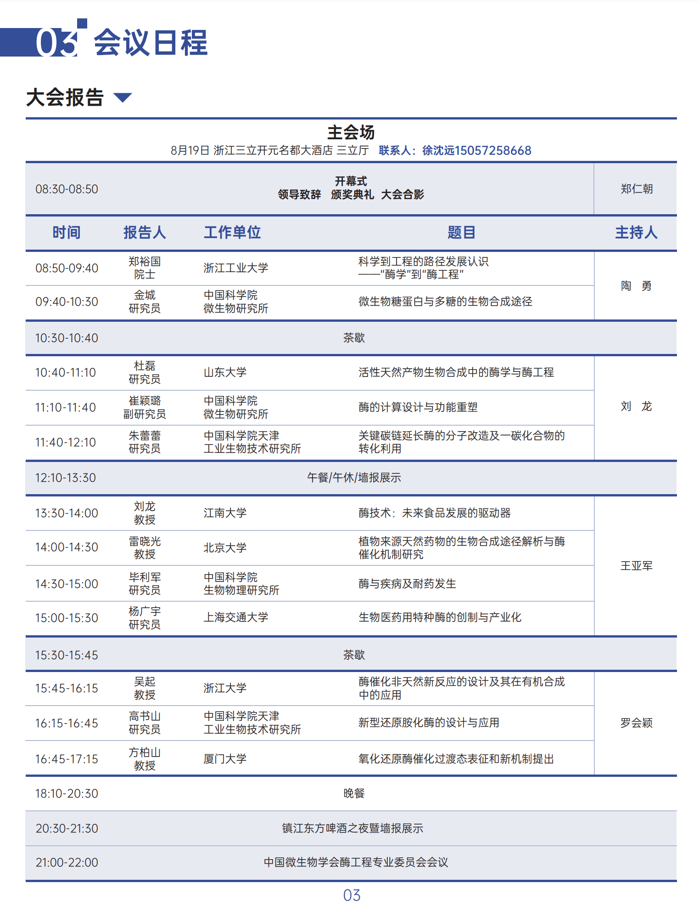

```{r setup, include=FALSE}
knitr::opts_chunk$set(echo = TRUE, message=FALSE, warning=FALSE)
```

## 第十四届中国酶工程学术研讨会
第十四届中国酶工程学术研讨会于2023年8月18日在杭州召开，历时三天。该会促进酶工程基础研究及科技成果转化，加强酶工程产学届科研、生产与应用交流合作。

### 1 会议议程

{fig.align='center'}


### 2 大会报告云图


```{r,echo = FALSE}
#我们要处理的第一个数据集由两个文件组成，`Enzyme-Yun-EDGES.csv`和`Enzyme-Yun-NODES.csv`
library('network')
nodes <- read.csv("Enzyme-Yun-NODES.csv", header=T, as.is=T)
links <- read.csv("Enzyme-Yun-EDGES.csv", header=T, as.is=T)
#head(nodes)
#head(links)
library('visNetwork') 
#visNetwork(nodes, links, width="100%", height="400px", background="#eeefff",           main="Network", submain="And what a great network it is!",           footer= "Hyperlinks and mentions among media sources")

vis.nodes <- nodes
vis.links <- links
## 节点属性
vis.nodes$shape  <- "dot"  
vis.nodes$shadow <- TRUE # 节点会投下阴影
vis.nodes$title  <- vis.nodes$institution  # 点击出现的文本
vis.nodes$label  <- vis.nodes$glossary  # 直接出现的文本
#vis.nodes$size   <- vis.nodes$audience.size # 节点的大小
vis.nodes$size <- 30
vis.nodes$font.size <- 36
vis.nodes$borderWidth <- 2 # 节点边缘的线条宽度
vis.nodes$color.background <- c("slategrey", "tomato")[vis.nodes$glossary.type]
vis.nodes$color.border <- "black"
vis.nodes$color.highlight.background <- "orange"
vis.nodes$color.highlight.border <- "darkred"
## 边属性
vis.links$width <- 3
vis.links$label <- vis.links$type

## 绘图
visNetwork(vis.nodes, vis.links, main="第十四届中国酶工程学术研讨会", submain="大会报告云图")
```


